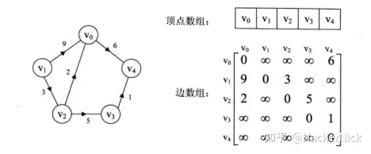
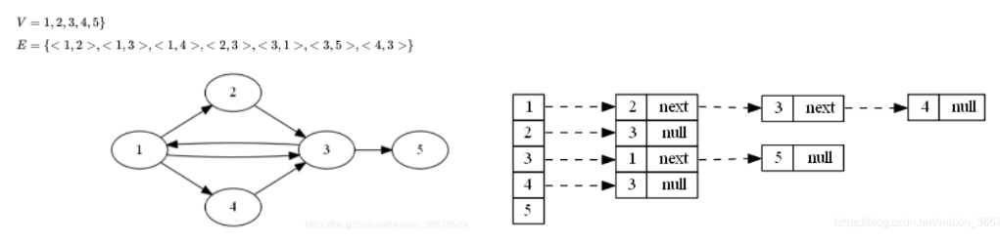

# 图相关数据结构

图的存储结构主要分两种，一种是邻接矩阵，一种是邻接表。

请了解好概念后，来看代码示例。

## 邻接矩阵

例如下图，利用Java代码[实现示例](../../src/main/java/lin/xc/coding/skill/datastructure/graph/TestAdjacencyMatrix.java)

## 邻接表

例如下图，利用Java代码[实现示例](../../src/main/java/lin/xc/coding/skill/datastructure/graph/TestAdjacencyList.java)

另外，提一下“逆邻接表”，“邻接表”存储顶点的出边，而“逆邻接表”主要存储顶点的入边，这里也同样给出例子

> 自解：拷贝过来的代码虽然有区别，其实这两个实现思路差不多

关于逆邻接表的Java代码[实现示例](../../src/main/java/lin/xc/coding/skill/datastructure/graph/TestInverseAdjacencyList.java)